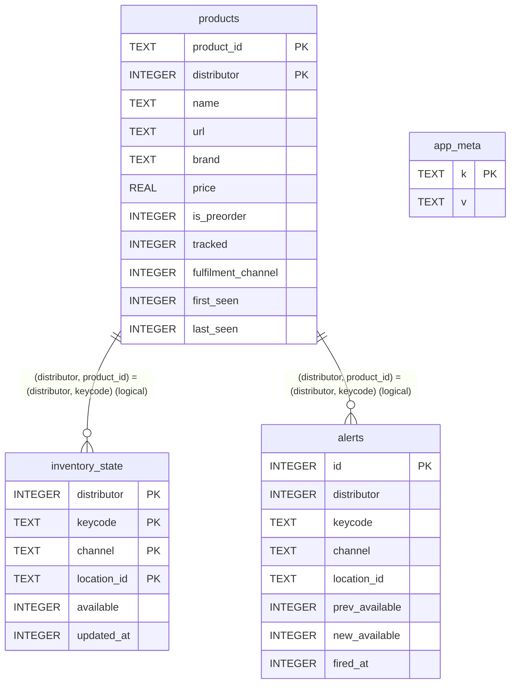
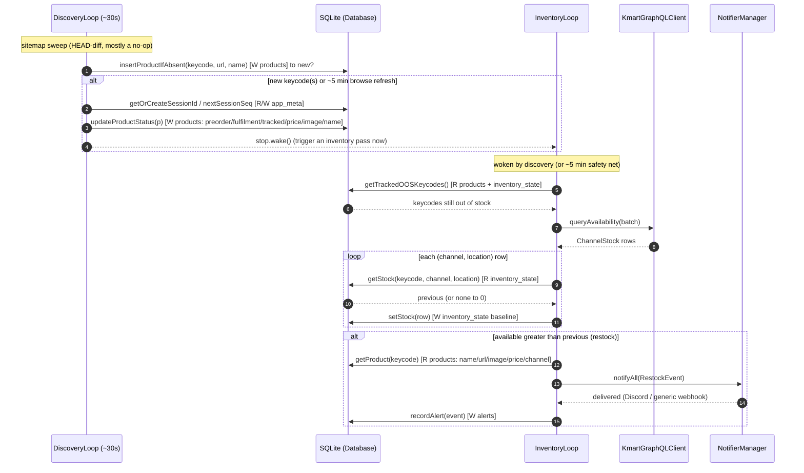

# RestockerApp — Database Reference

The service keeps all of its durable state in a single local **SQLite** file (`restocker.db` by
default, from `DatabaseConfig::path`). The database is the shared memory between the worker
threads: each retailer's **discovery** loop writes products, and its **inventory** loop reads which
ones to watch, records the last stock level it saw, and logs alerts. Two retailers are supported —
**Kmart** (`distributor = 1`) and **BigW** (`distributor = 2`) — and they share the same tables; a
product's identity is the `(distributor, product_id)` pair. This document describes every table and
column, how the tables relate, which code path touches each one, and exactly when they are read or
written during the notification flow.

All schema and queries live in [Database.cpp](src/Database.cpp) (the `CREATE TABLE` statements in
[`initSchema`](src/Database.cpp#L51)); the public API and the concurrency contract are in
[Database.h](src/Database.h); the row structs are in [Models.h](src/Models.h).

---

## 1. Overview

- **Engine / file:** SQLite, opened `OPEN_READWRITE | OPEN_CREATE` ([Database.cpp:40](src/Database.cpp#L40)).
- **Pragmas** ([Database.cpp:43-45](src/Database.cpp#L43)): `journal_mode=WAL` (concurrent
  reads while writing), `busy_timeout=5000` (wait up to 5 s on a lock instead of erroring),
  `foreign_keys=ON`.
- **Concurrency:** one `Database` instance is shared by both threads; **every public method takes
  `std::lock_guard<std::mutex> lock(mtx_)`** ([Database.h:56](src/Database.h)), so exactly one
  query runs at a time. WAL + the busy timeout keep that contention cheap.
- **Bootstrapping:** the schema is created on first run (idempotent `CREATE TABLE IF NOT EXISTS`),
  plus two guarded `ALTER TABLE` migrations that add `image_url` and `fulfilment_channel` to
  `products` databases created before those columns existed.
- **Schema v1 migration (multi-distributor):** `migrateToV1` renames `products.variation_id` →
  `product_id` and adds the `distributor` dimension. Because SQLite cannot alter a primary key in
  place, `products` and `inventory_state` are rebuilt (create new shape → copy, backfilling
  `distributor = 1` for the existing Kmart rows → drop old); `alerts` only gains a column. It is
  gated on an `app_meta` `schema_version` key (and a `PRAGMA table_info` check), runs inside one
  transaction, and is a no-op on an already-migrated or fresh database.
- **Foreign keys:** the pragma is on, but **no FK constraints are declared** — the cross-table
  links below are *logical* (joined on the keycode), not enforced by SQLite.

There are four tables: **`products`**, **`inventory_state`**, **`alerts`**, and **`app_meta`**.

---

## 2. Schema reference

### `products`

The catalogue of TCG products. Base fields come from the **product sitemap**; the status fields
are filled by the **Constructor browse** cross-reference.

For Kmart, base fields come from the **product sitemap** and status fields from the **Constructor
browse** cross-reference. For BigW, both come from the **search API**, with the URL resolved from
the BigW **sitemaps**.

| Column | Type | Default | Source | Responsibility |
|---|---|---|---|---|
| `product_id` | TEXT | — (PK) | sitemap / search | The retailer product id (Kmart keycode = trailing URL digits; BigW `articleId`). Part of the composite primary key. |
| `distributor` | INTEGER | 1 (PK) | discovery | Which retailer: **1 = Kmart, 2 = BigW**. Part of the composite primary key; ids are not unique across retailers. |
| `name` | TEXT | — | both | Display name. |
| `url` | TEXT | — | sitemap / resolver | Canonical absolute product URL. **Never overwritten** by enrichment. |
| `brand` | TEXT | NULL | enrich | Brand string. |
| `image_url` | TEXT | NULL | enrich | Product image (absolute URL); used in the Discord embed. |
| `price` | REAL | NULL | enrich | Price in dollars. |
| `is_preorder` | INTEGER | 0 | enrich | 1 for a pre-order. Flipped off at alert time if the release date has passed. |
| `preorder_release_date` | TEXT | NULL | enrich | ISO date string for pre-orders. |
| `tracked` | INTEGER | 1 | enrich | 1 ⇒ the inventory loop polls it; **0 ⇒ out-of-stock in `kmart.target_state`** (Kmart regional gate). BigW rows keep the default 1. |
| `fulfilment_channel` | INTEGER | 0 | enrich | Fulfilment policy (shared enum): 2 = in-store/pickup only, 3 = standard (pickup + delivery), 5 = online/delivery only, **0 = unknown**. Routes alerts. |
| `first_seen` | INTEGER | — | discovery | Epoch seconds when the row was first inserted. |
| `last_seen` | INTEGER | — | both | Epoch seconds of the most recent insert/enrichment. |

Primary key is the composite `(distributor, product_id)`.

### `inventory_state`

The last stock reading per product × channel × location — the baseline that makes restock
detection idempotent.

| Column | Type | Default | Responsibility |
|---|---|---|---|
| `distributor` | INTEGER | 1 (PK) | Retailer (1 = Kmart, 2 = BigW); matches `products.distributor`. |
| `keycode` | TEXT | — (PK) | Product id (= `products.product_id`). |
| `channel` | TEXT | — (PK) | `HOME_DELIVERY`, `CLICK_AND_COLLECT`, or `IN_STORE`. |
| `location_id` | TEXT | `''` (PK) | Store id; **`''` for national HOME_DELIVERY / Click&Collect totals**. |
| `available` | INTEGER | — | Last poll: Kmart units; BigW 0/1 availability (its quantity is unreliable). |
| `updated_at` | INTEGER | — | Epoch seconds of that reading. |

Primary key is the composite `(distributor, keycode, channel, location_id)`.

### `alerts`

Append-only audit log — one row per fired restock notification.

| Column | Type | Default | Responsibility |
|---|---|---|---|
| `id` | INTEGER | AUTOINCREMENT (PK) | Surrogate key. |
| `distributor` | INTEGER | 1 | Retailer (1 = Kmart, 2 = BigW). |
| `keycode` | TEXT | — | Product that restocked. |
| `channel` | TEXT | — | Channel of the triggering increase (largest delta). |
| `location_id` | TEXT | — | Location of that increase (`''` for national). |
| `prev_available` | INTEGER | — | Stock before the increase. |
| `new_available` | INTEGER | — | Stock after the increase. |
| `fired_at` | INTEGER | — | Epoch seconds the alert fired. |

### `app_meta`

Generic key/value store for small persistent state.

| Column | Type | Responsibility |
|---|---|---|
| `k` | TEXT (PK) | Key. |
| `v` | TEXT | Value. |

Current keys: **`schema_version`** (migration guard, `"1"` once the multi-distributor rebuild has
run), **`constructor_session_id`** (persistent anonymous UUID for the Constructor API),
**`constructor_session_seq`** (monotonic per-request counter), **`kmart_cookie`** +
**`kmart_user_agent`**, and **`bigw_cookie`** + **`bigw_user_agent`** (the latest cookie jar
harvested by the browser for each retailer's `"http"` gateway transport, plus the harvest browser's
User-Agent it must be replayed with, persisted so they survive restarts).

---

## 3. Table relationships

The links are **logical**, joined on the keycode — there are no enforced foreign keys. `app_meta`
is standalone.

---

## 4. Access map — who touches what

All product/stock methods take a leading `distributor` argument (or operate on a struct that
carries one) so the two retailers' rows never collide.

| Method ([Database.cpp](src/Database.cpp)) | Tables (R/W) | Called by |
|---|---|---|
| `insertProductIfAbsent(distributor, product_id, …)` | **W** `products` (base row; `INSERT OR IGNORE`) | discovery loops |
| `updateProductStatus(Product)` | **W** `products` (enrichment columns only) | discovery loops |
| `getOrCreateSessionId` / `nextSessionSeq` | **R/W** `app_meta` | DiscoveryLoop — before each browse sweep |
| `get/setKmartCookie` · `get/setKmartUserAgent` · `get/setBigWCookie` · `get/setBigWUserAgent` | **R/W** `app_meta` (`{kmart,bigw}_cookie`, `{kmart,bigw}_user_agent`) | the HTTP transports — seed at startup; persist after a browser re-harvest |
| `getTrackedOOSKeycodes(distributor)` | **R** `products` + `inventory_state` | InventoryLoop (Kmart) — start of pass |
| `getTrackedKeycodes(distributor)` | **R** `products` | BigWInventoryLoop — start of pass (polls all tracked products) |
| `getStock(distributor, …)` | **R** `inventory_state` | restock engine — per channel/location row |
| `setStock(ChannelStock)` | **W** `inventory_state` (`ON CONFLICT … DO UPDATE`) | restock engine — every row, always |
| `getProduct(distributor, product_id)` | **R** `products` | restock engine — alert enrichment |
| `recordAlert(RestockEvent)` | **W** `alerts` | restock engine — after a notification fires |

`getTrackedOOSKeycodes` defines the Kmart watch-list: products with `tracked = 1` whose
`MAX(available)` across all `inventory_state` rows is 0 (or absent). BigW instead polls **all**
tracked products via `getTrackedKeycodes`, because its discovery (search `inStock:true`) only
surfaces in-stock items — so it must keep polling them to observe them going out of stock and
thereby re-arm the next restock alert.

---

## 5. Notification flow — when each table is read/written

A single product's lifecycle from discovery → restock alert, annotating every database touch and
the cross-thread **wake** that triggers the inventory pass.

Key rules implied by the flow:

- **`setStock` runs for every row, even with no alert.** Persisting the new baseline every pass is
  what stops "still in stock" from re-alerting on the next poll.
- **A restock is `available > previous`, with `previous` defaulting to 0** when no
  `inventory_state` row exists — so a product first seen *already in stock* still alerts.
- **`recordAlert` (the only write to `alerts`) runs only after a notification fires** — it is the
  audit trail, not part of detection.
- **`app_meta` is touched by the discovery side** (the Constructor session) **and by the inventory
  transport** (`kmart_cookie`, seeded at startup and rewritten after a browser cookie re-harvest);
  it is not part of restock *detection*.
- The `tracked` flag (set by `updateProductStatus` from the browse `stateOOS` map) is what lets a
  product enter or leave the `getTrackedOOSKeycodes` watch-list between passes.

---

## 6. Concurrency & integrity

- A single `std::mutex` serialises every database call, so the discovery and inventory threads
  never corrupt each other's reads/writes; WAL + `busy_timeout=5000` keep that interleaving cheap.
- The discovery → inventory **wake** (via [`StopToken`](src/StopToken.h)) is the only cross-thread
  signal besides the database itself.
- `alerts` is **append-only** (an audit log); `inventory_state` and `app_meta` use upserts
  (`INSERT … ON CONFLICT … DO UPDATE`); `products` uses `INSERT OR IGNORE` for new rows and a
  targeted `UPDATE` for enrichment.
- The `ALTER TABLE` migrations are wrapped in try/catch so they are idempotent — re-running on an
  already-migrated database is a no-op.
