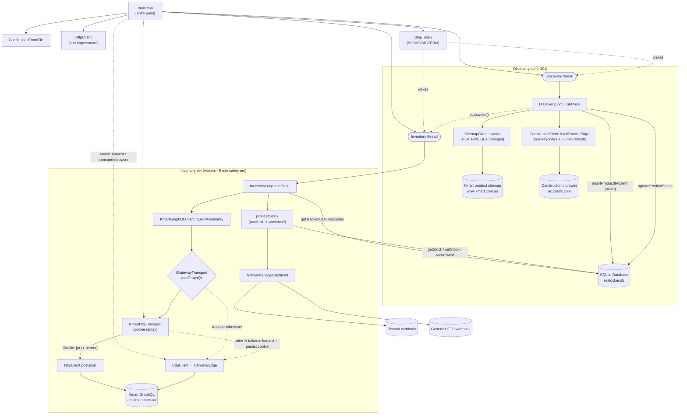

# RestockerApp — How the C++ Service Works

RestockerApp is a standalone C++17 service that watches Pokémon Trading Card Game
products on Australian retailers — **Kmart** and **BigW** — and fires webhook alerts (Discord
and/or a generic HTTP endpoint) the moment an item comes back into stock. It runs continuously as
per-retailer discovery + inventory loops backed by a single local SQLite database.

This document explains the architecture end-to-end: the component layout, the runtime flow, and
*why* each piece is built the way it is. The narrative below describes the **Kmart** pipeline in
detail; the **BigW** pipeline (see [§9](#9-bigw-distributor)) mirrors the same discovery → inventory
→ notify shape with retailer-specific clients, and both share the database, the notifier set, and
the restock-decision engine. All source lives under [src/](src/).

A product's identity across the shared tables is the `(distributor, product_id)` pair
(`distributor`: 1 = Kmart, 2 = BigW); see the [`Distributor`](src/Models.h) enum.

---

## 1. Overview

The service is organised into five tiers:

| Tier | Responsibility | Key code |
|------|----------------|----------|
| **Discovery** | Find TCG products via the product sitemap, enrich status via Constructor browse (fast, ~30s) | [DiscoveryLoop.cpp](src/DiscoveryLoop.cpp), [SitemapClient.cpp](src/SitemapClient.cpp), [ConstructorClient.cpp](src/ConstructorClient.cpp) |
| **Inventory** | Poll stock levels and detect restocks (event-driven — woken by discovery; ~5 min safety net) | [InventoryLoop.cpp](src/InventoryLoop.cpp), [KmartGraphQLClient.cpp](src/KmartGraphQLClient.cpp) |
| **Transport** | Get requests past Akamai Bot Manager (cookie replay by default; browser harvest/fallback) | [HttpClient.cpp](src/HttpClient.cpp), [KmartHttpTransport.cpp](src/KmartHttpTransport.cpp), [CdpClient.cpp](src/CdpClient.cpp), [GatewayTransport.h](src/GatewayTransport.h) |
| **Notification** | Fan out restock alerts | [NotifierManager.cpp](src/NotifierManager.cpp), [DiscordNotifier.cpp](src/DiscordNotifier.cpp), [GenericWebhookNotifier.cpp](src/GenericWebhookNotifier.cpp) |
| **Persistence / infra** | Store state, coordinate threads, config, shutdown | [Database.cpp](src/Database.cpp), [Config.cpp](src/Config.cpp), [StopToken.h](src/StopToken.h) |

The core idea is **fast, cheap discovery driving event-driven inventory**: discovery polls the
product sitemap every ~30s but stays cheap by HEAD-diffing the (large) sitemaps and only
re-downloading what changed, and only calls the Constructor browse endpoint for new products or a
periodic refresh. Whenever discovery learns something changed it **wakes** the inventory loop, so
a restock is checked immediately instead of on a fixed timer; the inventory loop also self-runs
every ~5 min as a safety net. The SQLite database is the shared memory between the two loops —
discovery writes products, inventory reads which ones to watch and remembers the last stock level
it saw — and a single `StopToken` carries both shutdown and the discovery→inventory wake.

---

## 2. Component Flow Diagram

How the code interacts with itself and with external systems.



**Reading the diagram:** `main` builds everything, then hands control to two worker threads.
Discovery feeds the `products` table; inventory reads from it, asks Kmart for live stock through
a pluggable transport, and — when stock rises — both records an alert and fans it out to the
notifiers. Every database edge is the same mutex-protected `Database` instance shared by both
threads.

---

## 3. Runtime Sequence Diagram

The lifecycle of a single product: *discovered → first poll (out of stock) → later poll
(restocked) → notified*. This mirrors the actual call order in
[DiscoveryLoop::runOnce](src/DiscoveryLoop.cpp#L36) and
[InventoryLoop::processStock](src/InventoryLoop.cpp#L37).

```mermaid
sequenceDiagram
  autonumber
  participant D as DiscoveryLoop
  participant SM as SitemapClient
  participant CC as ConstructorClient
  participant DB as Database
  participant I as InventoryLoop
  participant K as KmartGraphQLClient
  participant T as IGatewayTransport
  participant N as NotifierManager

  Note over D: Discovery pass (~30s cadence)
  D->>SM: sweep() — HEAD each sitemap, GET changed
  SM-->>D: keycode→url map (or nullopt if unchanged)
  D->>DB: insertProductIfAbsent(keycode, url, name) → new?
  opt new keycode(s) or ~5 min refresh
    D->>CC: fetchBrowsePage(group_id, page, session, seq)
    CC->>CC: parse + filter by URL prefix
    CC-->>D: products[] (preorder / fulfilment / stateOOS)
    D->>DB: updateProductStatus(p)  (enrichment; url untouched)
    D->>I: stop.wake() — check stock now
  end

  Note over I: Inventory pass (woken, or ~5 min safety net)
  I->>DB: getTrackedOOSKeycodes()
  DB-->>I: [keycodes still OOS]
  I->>K: queryAvailability(batch)
  K->>T: postGraphQL(url, payload)
  Note over T: http: POST with replayed Cookie jar (+ optional bearer);<br/>after N failures harvest fresh cookies via browser + persist, retry
  T-->>K: HTTP response (JSON)
  K-->>I: ChannelStock rows

  Note over I: rows grouped by keycode → one alert per product
  loop each ChannelStock row
    I->>DB: getStock(keycode, channel, location)
    DB-->>I: previous (or none → 0)
    I->>DB: setStock(new level)
  end
  alt any channel/location increased (restock!)
    I->>DB: getProduct(keycode) for name/url/image/price/pre-order
    I->>K: queryFindInStore(keycode)
    K->>T: postGraphQL(getFindInStore)
    T-->>K: per-store rows (name, level, phone)
    K-->>I: stores[] (merged with numeric units)
    I->>N: notifyAll(one rich RestockEvent)
    N->>N: Discord embed + generic webhook POST
    I->>DB: recordAlert(event)
  end
```

---

## 4. Component-by-Component Breakdown

### Entry point — [main.cpp](src/main.cpp)

**What:** Process startup, argument parsing, wiring, thread management, signal handling.

**How:** [`main`](src/main.cpp#L89) sets up the spdlog pattern, initialises libcurl once via the
RAII `CurlGlobal` wrapper ([line 84](src/main.cpp#L84)), then:

1. Parses CLI flags into an `Args` struct ([parseArgs](src/main.cpp#L56)): `--config`, `--once`,
   `--discovery-only`, `--inventory-only`, `--dry-run`, `--test-notify`, `--help`.
2. Loads config with [`Config::loadFromFile`](src/main.cpp#L101); a throw here aborts with a
   clear error and exit code 1.
3. `--test-notify` short-circuits ([line 110](src/main.cpp#L110)): it builds a synthetic
   `RestockEvent` and fires the notifiers without touching the DB or network — a quick way to
   validate webhook config.
4. Opens the `Database`, creates a `StopToken`, and registers it as the global `g_stop` so the
   SIGINT/SIGTERM handler can request shutdown ([lines 123-127](src/main.cpp#L123)).
5. Chooses the inventory transport: for `kmart.transport == "browser"` it constructs a
   `CdpClient`; otherwise (default `"http"`) it constructs a `KmartHttpTransport` wrapping the
   shared `HttpClient`, a lazy `CdpClient` cookie-harvester, and the `Database`. Either way the
   result is exposed only through the `IGatewayTransport*` pointer so `KmartGraphQLClient`
   doesn't care which one it got.
6. Constructs the two loops and either runs one pass each (`--once`) or spawns a thread per loop
   and joins them ([lines 161-166](src/main.cpp#L161)).

**Why:** All dependencies are constructed in `main` and passed in by reference — there are no
globals besides the signal-handler `StopToken`. This keeps every class independently testable
and makes the ownership graph obvious: `main` owns everything; the loops borrow.

### Shutdown signal — [StopToken.h](src/StopToken.h)

**What:** A cooperative shutdown flag with an *interruptible* sleep.

**How:** It wraps an `atomic<bool>` plus a `condition_variable`.
[`sleepFor`](src/StopToken.h#L28) blocks on `cv_.wait_for(...)` with a predicate, so when
[`requestStop`](src/StopToken.h#L16) flips the flag and calls `notify_all()`, a sleeping loop
wakes immediately and `sleepFor` returns `false` to signal "exit now".

**Why:** The loops sleep for minutes between passes. A naive `std::this_thread::sleep_for` would
make Ctrl-C take up to 45 minutes to take effect. The condition-variable approach gives instant,
clean shutdown while still being a plain time-based wait in the normal case.

### Discovery — [DiscoveryLoop.cpp](src/DiscoveryLoop.cpp) + [SitemapClient.cpp](src/SitemapClient.cpp) + [ConstructorClient.cpp](src/ConstructorClient.cpp)

**What:** Every ~30s, finds the full set of Pokémon TCG products from the Kmart product sitemap,
enriches their status from the Constructor browse endpoint, and pokes the inventory loop.

**How:** [`runOnce`](src/DiscoveryLoop.cpp) calls [`SitemapClient::sweep`](src/SitemapClient.cpp),
which GETs the small `sitemap-index.xml`, then for each `product-sitemap-*.xml` issues a cheap
**HEAD** and compares the `ETag`/`Last-Modified` to an in-memory cache — only the sitemaps that
actually changed are full-GET re-scanned. URLs containing `/product/pokemon-trading-card-game:`
are kept, and [`extractKeycodeFromUrl`](src/SitemapClient.cpp) takes the **trailing digits** as the
keycode (identical to Constructor's `variation_id`). `sweep()` returns the current `keycode → url`
map, or `nullopt` when nothing changed (the common case — then the pass does nothing).

Each keycode is inserted with [`db.insertProductIfAbsent`](src/Database.cpp) (keycode, sitemap
URL, a name de-slugged from the URL); it returns `true` only for genuinely new keycodes. If there
are new keycodes — or every `intervals.browse_refresh_seconds` (default 5 min) — discovery sweeps
the Constructor **browse group** ([`fetchBrowsePage`](src/ConstructorClient.cpp), reusing the
tolerant [`parseConstructorResults`](src/ConstructorClient.cpp)) once and calls
[`db.updateProductStatus`](src/Database.cpp) to fill `isPreOrderActive`, `preOrderReleaseDate`,
`FulfilmentChannel`, regional `stateOOS` (→ `tracked`), price, image, and the clean display name.
`updateProductStatus` leaves the sitemap `url` untouched and upgrades the name only when the browse
`value` is non-empty, so sitemap-only products keep their URL-derived name. Whenever a browse
cross-reference happens, discovery calls [`stop_.wake()`](src/StopToken.h) to trigger an inventory
pass immediately.

The regional gate is unchanged: if `kmart.target_state` (default `QLD`) is a key in a product's
`stateOOS` map it is stored but `tracked=0` (never polled); otherwise `tracked=1`. The browse
sweep keeps the same early-exit guards as before (`page * num_results_per_page >= total_results`,
and backing off when `ratelimit_remaining` drops below `min_ratelimit_remaining`).

**Why:** The sitemap is the authoritative, comprehensive list of TCG product URLs, and it changes
rarely — so HEAD-diffing makes a 30s poll nearly free (the product sitemaps are ~4.5 MB each and
send `Cache-Control: no-store`, so conditional GET is not honoured; HEAD + ETag diff is the cheap
substitute). The browse endpoint is small and carries the live status the sitemap lacks, so it is
only hit for new products or a periodic refresh. Driving the inventory loop by a wake (rather than
a slow fixed timer) is what makes a restock alert land within seconds.

### Inventory — [InventoryLoop.cpp](src/InventoryLoop.cpp) + [KmartGraphQLClient.cpp](src/KmartGraphQLClient.cpp)

**What:** Polls live stock for currently-out-of-stock products and fires alerts on restock. The
loop runs when **woken by discovery** (a browse cross-reference happened) via
[`StopToken::waitForOrWake`](src/StopToken.h), or on a ~5 min idle safety-net timer.

**How:** [`runOnce`](src/InventoryLoop.cpp#L65) asks the DB for
[`getTrackedOOSKeycodes`](src/InventoryLoop.cpp#L66) — products that are tracked and whose best
known stock across all channels is 0. It splits them into batches of `batch_size` (default 30)
and calls `KmartGraphQLClient::queryAvailability` per batch. The GraphQL client builds a
`getProductAvailability` query (postcode, country, the keycodes, and the `HOME_DELIVERY` /
`CLICK_AND_COLLECT` fulfilment methods), sends it through the `IGatewayTransport`, and parses the
response into `ChannelStock` rows.

The rows are then **grouped by keycode** and each product is handled by the shared
[`processRestock`](src/RestockEngine.cpp) helper (extracted so Kmart and BigW share one copy of the
alert logic), which fires **one consolidated alert per product**:

```cpp
for (const auto& s : rows) {
    int prev = db_.getStock(distributor, s.keycode, s.channel, s.location_id).value_or(0);
    if (s.available > prev) restocked = true;   // any channel increasing triggers it
    // capture HOME_DELIVERY / CLICK_AND_COLLECT totals + per-store numeric units
    db_.setStock(s);                            // always persist the new baseline
}
if (restocked) {
    RestockEvent e{...};                        // name, url, image, price, pre-order date
    int channel = db_.getProduct(distributor, keycode)->fulfilment_channel;
    if (channel == 2 && numericByLocation.empty()) return false;  // in-store/pickup only: need nearby stock
    // build stores[] from numericByLocation (units > 0 only), names/phone from the
    // storeEnrich callback (Kmart getFindInStore; BigW cached stores list), sort by
    // units desc, cap to instore_max
    notifiers_.notifyAll(e);
    db_.recordAlert(e);
}
```

The alert path also honours the product's **FulfilmentChannel**: channels 3/5 and unknown alert
on the online restock signal as before, while channel 2 (in-store only) is suppressed unless a
nearby store actually holds stock. The **nearby-store list is now built from the per-store numeric
units in `getProductAvailability`** (which now also requests `IN_STORE`), not from
`getFindInStore` — that follow-up call is used only to attach store names and phone numbers.
Stores with zero stock never appear, and each line shows the real unit count.

**Why:** Only checking out-of-stock keycodes keeps each pass small. Rather than a fixed short
interval, the pass is **triggered by the discovery wake** the instant status changes (with a
~5 min idle fallback) — the latency that actually matters for catching a restock. Treating a *first
sighting with positive stock* as a restock (because `prev` defaults to 0) means a product that
appears already in stock still alerts. Stock is always persisted, even with no alert, so the next
pass has an accurate baseline and "still in stock" doesn't re-alert. **Grouping by keycode** means
a product that restocks across several channels produces a *single* rich notification rather than
one message per channel/location. The extra `getFindInStore` call runs only when a restock
actually fires (rare), so the per-store enrichment costs nothing on idle passes. Batching plus a
per-batch delay keeps request volume polite.

### Transport abstraction — [GatewayTransport.h](src/GatewayTransport.h), [KmartHttpTransport.cpp](src/KmartHttpTransport.cpp), [HttpClient.cpp](src/HttpClient.cpp), [CdpClient.cpp](src/CdpClient.cpp)

**What:** Interchangeable ways to deliver the Kmart GraphQL POST past Akamai, behind one interface.

**How:** [`IGatewayTransport`](src/GatewayTransport.h#L13) declares a single method,
`postGraphQL(url, jsonBody) → HttpResponse`. `KmartGraphQLClient` holds only an
`IGatewayTransport&`, and `main` decides at startup which concrete transport to plug in:

- **`KmartHttpTransport`** (default, `transport: "http"`) — replays a valid **Akamai cookie jar**
  over a single plain-HTTP path ([`HttpClient::postJsonRaw`](src/HttpClient.cpp): no impersonation,
  an explicit `User-Agent`, no `sec-ch-ua*` headers) — the exact shape of the working curl. It holds
  a swappable credential set `{cookie, user_agent, token?}`, seeded from the last harvested set
  (DB) or config, and sends `Cookie` + (only if configured) `Authorization: Bearer`. It
  **self-heals**: after `kmart.harvest_after_failures` consecutive failures it calls the `CdpClient`
  harvester ([`harvestCookies`](src/CdpClient.cpp)) for a fresh cookie **and the browser's UA**,
  adopts that pair (dropping any token — cookies alone suffice), persists both via
  [`Database::setKmartCookie`/`setKmartUserAgent`](src/Database.cpp), and retries (a short
  harvest→replay loop absorbs the delay before Akamai validates a new `_abck`).
- **`HttpClient`** — the libcurl wrapper. Its `get`/`postJson` apply a curl-impersonate Chrome
  TLS/JA3 + HTTP-2 fingerprint (`impersonate_target`, default `chrome131`) for the discovery client
  and notifiers; `postJsonRaw` (used by the gateway replay) sends a **plain** request with no
  impersonation and an explicit UA — the captured-request shape.
- **`CdpClient`** (`transport: "browser"`, also the http transport's cookie harvester) — launches
  a *real* headless-or-headful Chrome/Edge via the Chrome DevTools Protocol, navigates to
  `kmart.com.au` to pick up genuine Akamai cookies, waits `page_settle_ms` for the bot-sensor JS to
  validate, then either reads the cookie jar back (`Network.getAllCookies`) or runs the GraphQL
  `fetch()` from inside the page context. The whole platform/websocket mess is hidden behind a
  PIMPL ([CdpClient.h](src/CdpClient.h#L37)).

**Why:** Kmart sits behind **Akamai Bot Manager**. The bot challenge that matters here lives in the
**cookies** the sensor JS solves in a browser — once you replay a valid jar, a plain HTTP POST
passes. So the default keeps the lightweight HTTP path and only spins up a browser to (re)harvest
cookies when they go stale, persisting the result so it survives restarts. The `"browser"` mode
(every call through CDP) remains as a fallback. The interface lets the service swap strategies via
one config line without the GraphQL logic knowing or caring.

### Persistence — [Database.cpp](src/Database.cpp) + [Models.h](src/Models.h)

**What:** A thread-safe SQLite layer and the data structs that move between components.

**How:** The constructor opens the DB and sets pragmas
([lines 43-45](src/Database.cpp#L43)): `journal_mode=WAL`, `busy_timeout=5000`,
`foreign_keys=ON`, then creates the schema:

- **`products`** — `(distributor, product_id)` composite PK, name/url/brand/`image_url`/price,
  pre-order fields, a `tracked` flag (0 when out of stock in `kmart.target_state`), a
  `fulfilment_channel` column (shared 2/3/5 enum; 0 = unknown), and `first_seen`/`last_seen`.
- **`inventory_state`** — `(distributor, keycode, channel, location_id)` composite PK with
  `available` and `updated_at`; `location_id` is `''` for national HOME_DELIVERY / Click-and-Collect
  totals.
- **`alerts`** — an append-only log of every fired restock (`distributor`, prev → new, timestamp).
- **`app_meta`** — key/value store holding `schema_version` (the multi-distributor migration guard),
  the Constructor.io `session_id` and sequence counter, and per-retailer `{kmart,bigw}_cookie` /
  `{kmart,bigw}_user_agent` (the latest Akamai cookie jar + UA harvested for each http transport,
  persisted so they survive restarts).

The `variation_id` → `product_id` rename and the `distributor` columns are applied to existing
databases by [`migrateToV1`](src/Database.cpp) — a one-time, transactional table rebuild gated on
`schema_version`. (`image_url` and `fulfilment_channel` are still added by the earlier guarded
`ALTER TABLE` migrations so pre-distributor databases upgrade in place first.)

Every public method takes `std::lock_guard<std::mutex> lock(mtx_)`.
[`insertProductIfAbsent`](src/Database.cpp) inserts a sitemap-discovered product's base fields and
returns whether a row was actually inserted (driving "new product" detection);
[`updateProductStatus`](src/Database.cpp) updates only the browse-sourced enrichment columns
(leaving the sitemap `url` intact). [`getTrackedOOSKeycodes`](src/Database.cpp) is the cross-table
query that defines the inventory watch-list (`MAX(available) = 0` across all channels).
[`setStock`](src/Database.cpp) is an upsert via `ON CONFLICT ... DO UPDATE`.

The shared structs in [Models.h](src/Models.h) are deliberately plain: `Product` (incl.
`image_url`, the `tracked` flag, and `fulfilment_channel`), `ChannelStock` (one stock reading),
`StoreStock` (one nearby-store reading: name, phone, and the numeric units from
`getProductAvailability`), and `RestockEvent` — the consolidated payload the notifiers consume,
carrying the image, price, pre-order date, HD/C&C totals, and the `stores[]` breakdown.

**Why:** SQLite gives durable, queryable state with zero server to run. WAL mode plus the busy
timeout lets the two threads write without tripping over each other, and the single mutex makes
correctness trivial — only one query touches the DB at a time. Storing the Constructor session in
`app_meta` keeps discovery's identity stable across restarts.

### Notifications — [NotifierManager.cpp](src/NotifierManager.cpp), [DiscordNotifier.cpp](src/DiscordNotifier.cpp), [GenericWebhookNotifier.cpp](src/GenericWebhookNotifier.cpp)

**What:** Deliver a `RestockEvent` to every enabled destination.

**How:** Each destination implements the `INotifier` interface (`notify(event)` + `name()`).
`NotifierManager` builds a `vector<unique_ptr<INotifier>>` from config and
[`notifyAll`](src/NotifierManager.cpp) iterates them, catching per-notifier failures so one bad
webhook can't sink the others. `DiscordNotifier` POSTs a **rich embed** to a Discord channel
webhook; `GenericWebhookNotifier` POSTs a flat JSON payload to any URL with configurable headers.
When `--dry-run` is set, the manager logs instead of sending.

The Discord embed ([`buildBody`](src/DiscordNotifier.cpp#L34)) renders a single attractive card
per product: the **product image** (`embed.image`), a **pre-order banner with release date** (gold)
or a green "Back in stock" line, **Home Delivery / Click & Collect counts**, **price**, and a
**🏬 Nearby stores** field listing each in-stock store as `**Broadway** — 4 left · (02) 9282 6600`
(capped to fit Discord's 1024-char field limit), with an ISO-8601 timestamp footer.

> **Delivery note — DMs vs channel webhooks.** A Discord *webhook* can only post into a channel,
> never a user's DM. To keep alerts private, point the webhook at a channel in a private server
> only you can see. A true DM would require a Discord *bot* (bot token + your user ID, with the
> bot sharing a server with you); this build uses the simpler private-channel webhook.

**Why:** The interface + manager pattern means adding a new channel (Telegram, Slack, …) is just
one new `INotifier` — no changes to the inventory loop. Both notifiers reuse the same `HttpClient`
that everything else uses, and both consume the same enriched `RestockEvent`.

### Configuration — [Config.h](src/Config.h) / [Config.cpp](src/Config.cpp)

**What:** Typed, validated settings loaded once from a JSON file at startup.

**How:** [`Config::loadFromFile`](src/Config.h#L97) parses JSON (nlohmann-json) into nested
structs — `ConstructorConfig`, `KmartConfig`, `BrowserConfig`, `IntervalsConfig`,
`NotifiersConfig`, `HttpConfig`, `DatabaseConfig` — each with sensible defaults baked in
([Config.h](src/Config.h)). It throws `std::runtime_error` on a missing file, parse failure, or
invalid values. There is no hot-reload; config is read-only after load. `KmartConfig` carries the
http-transport credentials: `cookie` (captured Akamai jar), `auth_token` (optional bearer),
`user_agent` (UA paired with the cookie, default the Kmart iPhone app), `harvest_after_failures`
(default 3), and `extra_headers`; `config.json` is gitignored so these secrets stay local.

**Why:** Every tunable — poll intervals and jitter, batch sizes, the impersonation target, the
browser settle delay, the sitemap/browse discovery settings, webhook URLs — lives in one place
with defaults, so the
service runs out of the box and is reconfigured without recompiling. Read-only-after-load means
the loops never need to lock around config.

---

## 5. Concurrency & Shutdown

- **Two worker threads**, one per loop, spawned in [main](src/main.cpp#L162). They share nothing
  directly except the `Database` and the `StopToken`.
- **One mutex** (`Database::mtx_`) serialises every DB access, so the discovery and inventory
  threads can read/write the same tables safely.
- **Interruptible sleeps**: both loops wait via `StopToken::sleepFor`, and every long pause inside
  a pass is also guarded by it.
- **Graceful shutdown**: `SIGINT`/`SIGTERM` → `handleSignal` → `g_stop->requestStop()` → the
  condition variable wakes both loops, they finish the current iteration, return from `run()`, and
  `main` joins the threads and exits cleanly with "RestockerApp shut down cleanly".
- **Crash isolation**: each `runOnce` is wrapped in try/catch inside `run()`, so a single failed
  pass logs an error and the loop continues rather than killing the thread.

---

## 6. External Systems

| System | Purpose | Protocol | Cadence | Timeout |
|--------|---------|----------|---------|---------|
| **Kmart product sitemap** (`www.kmart.com.au/sitemap-index.xml` + `product-sitemap-*.xml`) | New-product discovery (keycode + URL) | HTTPS HEAD-diff, GET changed only, via curl-impersonate | ~30s (sitemap_seconds) | 15s |
| **Constructor.io browse** (`ac.cnstrc.com`) | Product status (pre-order / fulfilment / regional / price / image / name) | HTTPS GET via curl-impersonate | new products + full refresh ~5 min | 15s |
| **Kmart GraphQL** (`api.kmart.com.au/gateway/graphql`) | `getProductAvailability` (HD/CnC/in-store stock) + `getFindInStore` (store name/phone enrichment, only on a restock) | HTTPS plain cookie-replay POST (default); browser (CDP) only to re-harvest cookies or as `transport="browser"` fallback | woken by discovery; ~5 min safety net | 15s / CDP 30s per command |
| **Discord webhook** | Restock alerts | HTTPS POST (embed JSON) | per restock | 15s |
| **Generic HTTP endpoint** | Restock alerts | HTTPS POST (flat JSON + custom headers) | per restock | 15s |
| **Chrome / Edge** (local) | Cookie harvest for the http transport (or Akamai evasion for the GraphQL POST in `transport="browser"`) | Chrome DevTools Protocol over WebSocket | only on cookie (re)harvest, or each pass in browser mode | `cdp_timeout_ms` (30s) |
| **SQLite** (`restocker.db`, local file) | Persistence + cross-thread state | File I/O (WAL) | every DB op | `busy_timeout` 5s |

---

## 7. Build & Run

**Build system:** CMake ≥ 3.20, C++17, dependencies via vcpkg
([CMakeLists.txt](CMakeLists.txt)).

Dependencies: `nlohmann-json` (JSON), `SQLiteCpp` (SQLite wrapper), `spdlog` (logging),
`Threads`, and **curl-impersonate** (fetched by
[cmake/FetchCurlImpersonate.cmake](cmake/FetchCurlImpersonate.cmake) for the Chrome TLS
fingerprint). On Windows the curl-impersonate runtime DLLs are copied next to the executable
post-build; on Linux an RPATH points at the extracted `.so`.

```bash
export VCPKG_ROOT=/path/to/vcpkg
cmake --preset vcpkg
cmake --build --preset vcpkg
# → build/RestockerApp (RestockerApp.exe on Windows)
```

**Running:**

```bash
RestockerApp                    # run both loops continuously
RestockerApp --once             # one discovery + one inventory pass, then exit
RestockerApp --discovery-only   # only the discovery loop
RestockerApp --inventory-only   # only the inventory loop
RestockerApp --dry-run          # detect restocks but don't POST to notifiers
RestockerApp --test-notify      # send a synthetic restock to all notifiers and exit
RestockerApp --distributor bigw # run only one retailer's loops (all|kmart|bigw)
RestockerApp --config my.json   # use a specific config file (default config.json)
```

A typical first run is `--test-notify` (verify webhooks), then `--once --discovery-only`
(populate the `products` table), then the full service.

---

## 9. BigW distributor

BigW is a second retailer running alongside Kmart, gated by the `bigw` config block
(`"enabled": true`). It reuses the shared `Database`, `NotifierManager`, the
[`processRestock`](src/RestockEngine.cpp) engine, and a second `StopToken`, but has its own clients
and loops on their own threads. The design is parallel rather than abstracted behind one interface
because the two retailers' discovery sources, request shapes, and URL handling differ too much to
share usefully.

| Tier | BigW code | Notes |
|------|-----------|-------|
| **Discovery** | [BigWDiscoveryLoop.cpp](src/BigWDiscoveryLoop.cpp), [BigWSearchClient.cpp](src/BigWSearchClient.cpp), [BigWSitemapResolver.cpp](src/BigWSitemapResolver.cpp) | Search API is the source of truth (`POST search/v1/search`); the `EssentialSafety: "For ages 6+"` spec is the genuine-TCG filter; the product URL is resolved from the BigW sitemaps by trailing `/p/<id>`. |
| **Inventory** | [BigWInventoryLoop.cpp](src/BigWInventoryLoop.cpp), [BigWAvailabilityClient.cpp](src/BigWAvailabilityClient.cpp), [BigWStoresClient.cpp](src/BigWStoresClient.cpp) | Per-product GET (`availability/v0/product/{id}`); uses each channel's `available` boolean (quantity is unreliable) → 0/1; `instore→IN_STORE`, `pickup→CLICK_AND_COLLECT`, any delivery method → `HOME_DELIVERY`. |
| **Transport** | [BigWHttpTransport.cpp](src/BigWHttpTransport.cpp) | Same Akamai cookie-replay + browser-harvest pattern as Kmart, pointed at `bigw.com.au` (a second `CdpClient` with `cookie_domain = "bigw.com.au"`); adds a raw GET path via `HttpClient::getRaw`. |

**Field mapping** (search → `products`): `product_id = identifiers.articleId`,
`name = information.name`, `brand = information.brand.name`, `price = prices.<STATE>.price.cents/100`,
and `fulfilment_channel` 2/3/5 from the pickup/delivery flags (same enum and Discord routing as
Kmart). Alerts share the existing webhooks and name the retailer.

**Re-arm semantics:** the search filters `inStock:true`, so discovery only surfaces in-stock items.
To still catch the *out-of-stock → back-in-stock* cycle the user expects, the BigW inventory loop
polls **all** tracked products (`getTrackedKeycodes`, not just OOS ones): when a product goes
unavailable the loop records `available = 0` (no alert), so the next `0 → 1` transition fires a
fresh alert — exactly the shared engine's `available > previous` rule with values in `{0, 1}`.

**To verify against live data:** the example search `articleId` (7 digits) and the example sitemap
`/p/<id>` (10 digits) differ, so the resolver logs its URL-resolution hit-rate. Confirm the
`/p/<id>` ↔ `articleId` match holds (or adjust the matching field) before relying on resolved URLs;
an unresolved URL is non-fatal (the alert still fires, just without a link).
