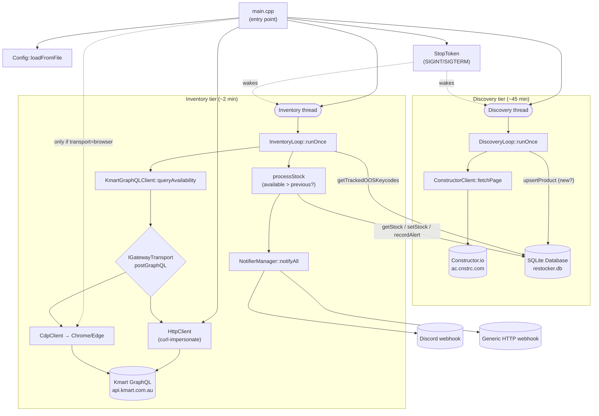
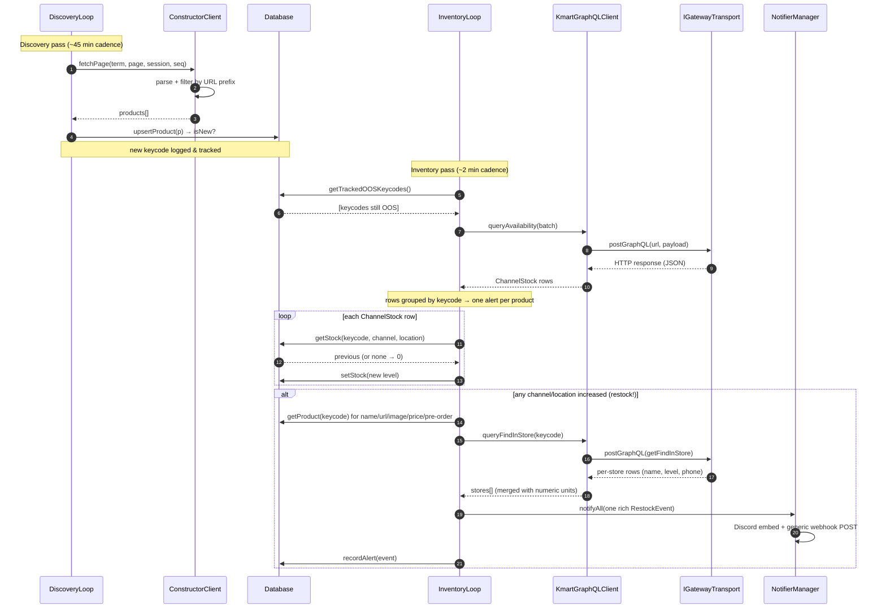

# RestockerApp — How the C++ Service Works

RestockerApp is a standalone C++17 service that watches Pokémon Trading Card Game
products on the **Kmart Australia** storefront and fires webhook alerts (Discord and/or a
generic HTTP endpoint) the moment an item comes back into stock. It runs continuously as two
independent polling loops backed by a local SQLite database.

This document explains the architecture end-to-end: the component layout, the runtime flow, and
*why* each piece is built the way it is. All source lives under [src/](src/).

---

## 1. Overview

The service is organised into five tiers:

| Tier | Responsibility | Key code |
|------|----------------|----------|
| **Discovery** | Find new Pokémon TCG products (slow, ~45 min) | [DiscoveryLoop.cpp](src/DiscoveryLoop.cpp), [ConstructorClient.cpp](src/ConstructorClient.cpp) |
| **Inventory** | Poll stock levels and detect restocks (fast, ~2 min) | [InventoryLoop.cpp](src/InventoryLoop.cpp), [KmartGraphQLClient.cpp](src/KmartGraphQLClient.cpp) |
| **Transport** | Get requests past Akamai Bot Manager | [HttpClient.cpp](src/HttpClient.cpp), [CdpClient.cpp](src/CdpClient.cpp), [GatewayTransport.h](src/GatewayTransport.h) |
| **Notification** | Fan out restock alerts | [NotifierManager.cpp](src/NotifierManager.cpp), [DiscordNotifier.cpp](src/DiscordNotifier.cpp), [GenericWebhookNotifier.cpp](src/GenericWebhookNotifier.cpp) |
| **Persistence / infra** | Store state, coordinate threads, config, shutdown | [Database.cpp](src/Database.cpp), [Config.cpp](src/Config.cpp), [StopToken.h](src/StopToken.h) |

The core idea is a **two-speed split**: discovery is expensive and rate-limited, so it runs
rarely; inventory checks only the products that are currently out of stock, so it can run often
and cheaply. The SQLite database is the shared memory between the two loops — discovery writes
products, inventory reads which ones to watch and remembers the last stock level it saw.

---

## 2. Component Flow Diagram

How the code interacts with itself and with external systems.



**Reading the diagram:** `main` builds everything, then hands control to two worker threads.
Discovery feeds the `products` table; inventory reads from it, asks Kmart for live stock through
a pluggable transport, and — when stock rises — both records an alert and fans it out to the
notifiers. Every database edge is the same mutex-protected `Database` instance shared by both
threads.

---

## 3. Runtime Sequence Diagram

The lifecycle of a single product: *discovered → first poll (out of stock) → later poll
(restocked) → notified*. This mirrors the actual call order in
[DiscoveryLoop::runOnce](src/DiscoveryLoop.cpp#L36) and
[InventoryLoop::processStock](src/InventoryLoop.cpp#L37).



---

## 4. Component-by-Component Breakdown

### Entry point — [main.cpp](src/main.cpp)

**What:** Process startup, argument parsing, wiring, thread management, signal handling.

**How:** [`main`](src/main.cpp#L89) sets up the spdlog pattern, initialises libcurl once via the
RAII `CurlGlobal` wrapper ([line 84](src/main.cpp#L84)), then:

1. Parses CLI flags into an `Args` struct ([parseArgs](src/main.cpp#L56)): `--config`, `--once`,
   `--discovery-only`, `--inventory-only`, `--dry-run`, `--test-notify`, `--help`.
2. Loads config with [`Config::loadFromFile`](src/main.cpp#L101); a throw here aborts with a
   clear error and exit code 1.
3. `--test-notify` short-circuits ([line 110](src/main.cpp#L110)): it builds a synthetic
   `RestockEvent` and fires the notifiers without touching the DB or network — a quick way to
   validate webhook config.
4. Opens the `Database`, creates a `StopToken`, and registers it as the global `g_stop` so the
   SIGINT/SIGTERM handler can request shutdown ([lines 123-127](src/main.cpp#L123)).
5. Chooses the inventory transport ([lines 133-143](src/main.cpp#L133)): if
   `kmart.transport == "browser"` it constructs a `CdpClient`; otherwise it uses the
   `HttpClient`. Either way the result is exposed only through the `IGatewayTransport*` pointer
   so `KmartGraphQLClient` doesn't care which one it got.
6. Constructs the two loops and either runs one pass each (`--once`) or spawns a thread per loop
   and joins them ([lines 161-166](src/main.cpp#L161)).

**Why:** All dependencies are constructed in `main` and passed in by reference — there are no
globals besides the signal-handler `StopToken`. This keeps every class independently testable
and makes the ownership graph obvious: `main` owns everything; the loops borrow.

### Shutdown signal — [StopToken.h](src/StopToken.h)

**What:** A cooperative shutdown flag with an *interruptible* sleep.

**How:** It wraps an `atomic<bool>` plus a `condition_variable`.
[`sleepFor`](src/StopToken.h#L28) blocks on `cv_.wait_for(...)` with a predicate, so when
[`requestStop`](src/StopToken.h#L16) flips the flag and calls `notify_all()`, a sleeping loop
wakes immediately and `sleepFor` returns `false` to signal "exit now".

**Why:** The loops sleep for minutes between passes. A naive `std::this_thread::sleep_for` would
make Ctrl-C take up to 45 minutes to take effect. The condition-variable approach gives instant,
clean shutdown while still being a plain time-based wait in the normal case.

### Discovery — [DiscoveryLoop.cpp](src/DiscoveryLoop.cpp) + [ConstructorClient.cpp](src/ConstructorClient.cpp)

**What:** Periodically finds new Pokémon TCG products and records them.

**How:** [`runOnce`](src/DiscoveryLoop.cpp#L36) loops over each configured search term and pages
through results (up to `max_pages`). For each page it calls
[`ConstructorClient::fetchPage`](src/DiscoveryLoop.cpp#L45) with a persistent anonymous
`session_id` and a monotonic sequence number (both from the DB), plus an epoch-ms cache-buster.
The client hits Constructor.io, parses the tolerant JSON, and keeps only results whose `url`
starts with `/product/pokemon-trading-card-game:`. Each match is pushed through
[`db.upsertProduct`](src/DiscoveryLoop.cpp#L54), which returns `true` for genuinely new keycodes
(those get logged as "discovered new product").

The parser also reads two regional/policy fields from the Constructor `data` object:
`stateOOS` (a state → exhausted-allocation map) and `FulfilmentChannel`. If the configured
`kmart.target_state` (default `QLD`, matching postcode `4221`) is present as a key in `stateOOS`,
the product is **stored but marked `tracked=0`** so the inventory tier never polls it — it can't
be fulfilled to our region anyway. When the state key is absent the product is `tracked=1` and
promoted to polling. Because this is recomputed on every discovery refresh, a product flips
between tracked/untracked as its regional availability changes. `FulfilmentChannel` is persisted
for use at alert time (see Inventory).

The loop has three early-exit guards: it stops paging a term once
`page * num_results_per_page >= total_results` ([line 66](src/DiscoveryLoop.cpp#L66)), it bails
out of the whole pass if the `ratelimit_remaining` header drops below
`min_ratelimit_remaining` ([line 71](src/DiscoveryLoop.cpp#L71)), and every wait uses
`stop_.sleepFor` so shutdown is honoured mid-pass.

**Why:** Discovery is the rate-limited, "expensive" half of the system, so it runs on a long
(~45 min) jittered interval and actively backs off the Constructor API. The session id + sequence
counter make the requests look like a normal browsing session to Constructor.io. Filtering by URL
prefix is a cheap, strict way to keep only TCG products out of broad search terms like
"pokemon cards".

### Inventory — [InventoryLoop.cpp](src/InventoryLoop.cpp) + [KmartGraphQLClient.cpp](src/KmartGraphQLClient.cpp)

**What:** Polls live stock for currently-out-of-stock products and fires alerts on restock.

**How:** [`runOnce`](src/InventoryLoop.cpp#L65) asks the DB for
[`getTrackedOOSKeycodes`](src/InventoryLoop.cpp#L66) — products that are tracked and whose best
known stock across all channels is 0. It splits them into batches of `batch_size` (default 30)
and calls `KmartGraphQLClient::queryAvailability` per batch. The GraphQL client builds a
`getProductAvailability` query (postcode, country, the keycodes, and the `HOME_DELIVERY` /
`CLICK_AND_COLLECT` fulfilment methods), sends it through the `IGatewayTransport`, and parses the
response into `ChannelStock` rows.

The rows are then **grouped by keycode** and each product is handled by
[`processProduct`](src/InventoryLoop.cpp#L37), which fires **one consolidated alert per product**:

```cpp
for (const auto& s : rows) {
    int prev = db_.getStock(s.keycode, s.channel, s.location_id).value_or(0);
    if (s.available > prev) restocked = true;   // any channel increasing triggers it
    // capture HOME_DELIVERY / CLICK_AND_COLLECT totals + per-store numeric units
    db_.setStock(s);                            // always persist the new baseline
}
if (restocked) {
    RestockEvent e{...};                        // name, url, image, price, pre-order date
    int channel = db_.getProduct(keycode)->fulfilment_channel;
    if (channel == 2 && numericByLocation.empty()) return false;  // in-store only: need nearby stock
    // build stores[] from numericByLocation (units > 0 only), names/phone from
    // getFindInStore, sort by units desc, cap to kmart.instore_max
    notifiers_.notifyAll(e);
    db_.recordAlert(e);
}
```

The alert path also honours the product's **FulfilmentChannel**: channels 3/5 and unknown alert
on the online restock signal as before, while channel 2 (in-store only) is suppressed unless a
nearby store actually holds stock. The **nearby-store list is now built from the per-store numeric
units in `getProductAvailability`** (which now also requests `IN_STORE`), not from
`getFindInStore` — that follow-up call is used only to attach store names and phone numbers.
Stores with zero stock never appear, and each line shows the real unit count.

**Why:** Only checking out-of-stock keycodes keeps each pass small and lets it run on a short
(~2 min) interval — the latency that actually matters for catching a restock. Treating a *first
sighting with positive stock* as a restock (because `prev` defaults to 0) means a product that
appears already in stock still alerts. Stock is always persisted, even with no alert, so the next
pass has an accurate baseline and "still in stock" doesn't re-alert. **Grouping by keycode** means
a product that restocks across several channels produces a *single* rich notification rather than
one message per channel/location. The extra `getFindInStore` call runs only when a restock
actually fires (rare), so the per-store enrichment costs nothing on idle passes. Batching plus a
per-batch delay keeps request volume polite.

### Transport abstraction — [GatewayTransport.h](src/GatewayTransport.h), [HttpClient.cpp](src/HttpClient.cpp), [CdpClient.cpp](src/CdpClient.cpp)

**What:** Two interchangeable ways to deliver the Kmart GraphQL POST, behind one interface.

**How:** [`IGatewayTransport`](src/GatewayTransport.h#L13) declares a single method,
`postGraphQL(url, jsonBody) → HttpResponse`. `KmartGraphQLClient` holds only an
`IGatewayTransport&`, and `main` decides at startup which concrete transport to plug in:

- **`HttpClient`** — a libcurl wrapper that calls curl-impersonate to apply a Chrome TLS/JA3 +
  HTTP-2 fingerprint (`impersonate_target`, default `chrome131`) along with realistic browser
  headers. It's also the transport used by the discovery client and the notifiers.
- **`CdpClient`** — launches a *real* headless-or-headful Chrome/Edge via the Chrome DevTools
  Protocol, navigates to `kmart.com.au` to pick up genuine Akamai cookies, waits
  `page_settle_ms` for the bot-sensor JS to validate, then runs the GraphQL `fetch()` from inside
  the page context. The whole platform/websocket mess is hidden behind a PIMPL
  ([CdpClient.h](src/CdpClient.h#L37)).

**Why:** Kmart sits behind **Akamai Bot Manager**, which fingerprints the TLS handshake and HTTP
client. curl-impersonate gets *close* enough for many endpoints, but Akamai denylists even that on
the GraphQL gateway — so the default (`transport: "browser"`) routes through an actual browser,
whose fingerprint and cookies are genuine and therefore pass. The interface lets the service swap
strategies via one config line without the GraphQL logic knowing or caring; the HTTP path stays as
a lighter fallback.

### Persistence — [Database.cpp](src/Database.cpp) + [Models.h](src/Models.h)

**What:** A thread-safe SQLite layer and the data structs that move between components.

**How:** The constructor opens the DB and sets pragmas
([lines 43-45](src/Database.cpp#L43)): `journal_mode=WAL`, `busy_timeout=5000`,
`foreign_keys=ON`, then creates the schema:

- **`products`** — `variation_id` (keycode) PK, name/url/brand/`image_url`/price, pre-order
  fields, a `tracked` flag (0 when out of stock in `kmart.target_state`), a `fulfilment_channel`
  column (Kmart FulfilmentChannel; 0 = unknown), and `first_seen`/`last_seen`. (`image_url` and
  `fulfilment_channel` are added by guarded `ALTER TABLE` migrations so existing databases upgrade
  in place.)
- **`inventory_state`** — `(keycode, channel, location_id)` composite PK with `available` and
  `updated_at`; `location_id` is `''` for national HOME_DELIVERY / Click-and-Collect totals.
- **`alerts`** — an append-only log of every fired restock (prev → new, timestamp).
- **`app_meta`** — key/value store holding the Constructor.io `session_id` and sequence counter.

Every public method takes `std::lock_guard<std::mutex> lock(mtx_)`.
[`upsertProduct`](src/Database.cpp#L76) returns whether the row was new (driving the "discovered"
log). [`getTrackedOOSKeycodes`](src/Database.cpp#L123) is the cross-table query that defines the
inventory watch-list (`MAX(available) = 0` across all channels).
[`setStock`](src/Database.cpp#L174) is an upsert via `ON CONFLICT ... DO UPDATE`.

The shared structs in [Models.h](src/Models.h) are deliberately plain: `Product` (incl.
`image_url`, the `tracked` flag, and `fulfilment_channel`), `ChannelStock` (one stock reading),
`StoreStock` (one nearby-store reading: name, phone, and the numeric units from
`getProductAvailability`), and `RestockEvent` — the consolidated payload the notifiers consume,
carrying the image, price, pre-order date, HD/C&C totals, and the `stores[]` breakdown.

**Why:** SQLite gives durable, queryable state with zero server to run. WAL mode plus the busy
timeout lets the two threads write without tripping over each other, and the single mutex makes
correctness trivial — only one query touches the DB at a time. Storing the Constructor session in
`app_meta` keeps discovery's identity stable across restarts.

### Notifications — [NotifierManager.cpp](src/NotifierManager.cpp), [DiscordNotifier.cpp](src/DiscordNotifier.cpp), [GenericWebhookNotifier.cpp](src/GenericWebhookNotifier.cpp)

**What:** Deliver a `RestockEvent` to every enabled destination.

**How:** Each destination implements the `INotifier` interface (`notify(event)` + `name()`).
`NotifierManager` builds a `vector<unique_ptr<INotifier>>` from config and
[`notifyAll`](src/NotifierManager.cpp) iterates them, catching per-notifier failures so one bad
webhook can't sink the others. `DiscordNotifier` POSTs a **rich embed** to a Discord channel
webhook; `GenericWebhookNotifier` POSTs a flat JSON payload to any URL with configurable headers.
When `--dry-run` is set, the manager logs instead of sending.

The Discord embed ([`buildBody`](src/DiscordNotifier.cpp#L34)) renders a single attractive card
per product: the **product image** (`embed.image`), a **pre-order banner with release date** (gold)
or a green "Back in stock" line, **Home Delivery / Click & Collect counts**, **price**, and a
**🏬 Nearby stores** field listing each in-stock store as `**Broadway** — 4 left · (02) 9282 6600`
(capped to fit Discord's 1024-char field limit), with an ISO-8601 timestamp footer.

> **Delivery note — DMs vs channel webhooks.** A Discord *webhook* can only post into a channel,
> never a user's DM. To keep alerts private, point the webhook at a channel in a private server
> only you can see. A true DM would require a Discord *bot* (bot token + your user ID, with the
> bot sharing a server with you); this build uses the simpler private-channel webhook.

**Why:** The interface + manager pattern means adding a new channel (Telegram, Slack, …) is just
one new `INotifier` — no changes to the inventory loop. Both notifiers reuse the same `HttpClient`
that everything else uses, and both consume the same enriched `RestockEvent`.

### Configuration — [Config.h](src/Config.h) / [Config.cpp](src/Config.cpp)

**What:** Typed, validated settings loaded once from a JSON file at startup.

**How:** [`Config::loadFromFile`](src/Config.h#L97) parses JSON (nlohmann-json) into nested
structs — `ConstructorConfig`, `KmartConfig`, `BrowserConfig`, `IntervalsConfig`,
`NotifiersConfig`, `HttpConfig`, `DatabaseConfig` — each with sensible defaults baked in
([Config.h](src/Config.h)). It throws `std::runtime_error` on a missing file, parse failure, or
invalid values. There is no hot-reload; config is read-only after load.

**Why:** Every tunable — poll intervals and jitter, batch sizes, the impersonation target, the
browser settle delay, search terms, webhook URLs — lives in one place with defaults, so the
service runs out of the box and is reconfigured without recompiling. Read-only-after-load means
the loops never need to lock around config.

---

## 5. Concurrency & Shutdown

- **Two worker threads**, one per loop, spawned in [main](src/main.cpp#L162). They share nothing
  directly except the `Database` and the `StopToken`.
- **One mutex** (`Database::mtx_`) serialises every DB access, so the discovery and inventory
  threads can read/write the same tables safely.
- **Interruptible sleeps**: both loops wait via `StopToken::sleepFor`, and every long pause inside
  a pass is also guarded by it.
- **Graceful shutdown**: `SIGINT`/`SIGTERM` → `handleSignal` → `g_stop->requestStop()` → the
  condition variable wakes both loops, they finish the current iteration, return from `run()`, and
  `main` joins the threads and exits cleanly with "RestockerApp shut down cleanly".
- **Crash isolation**: each `runOnce` is wrapped in try/catch inside `run()`, so a single failed
  pass logs an error and the loop continues rather than killing the thread.

---

## 6. External Systems

| System | Purpose | Protocol | Cadence | Timeout |
|--------|---------|----------|---------|---------|
| **Constructor.io** (`ac.cnstrc.com`) | Product discovery | HTTPS GET via curl-impersonate | ~45 min (2700s ±900s) | 15s |
| **Kmart GraphQL** (`api.kmart.com.au/gateway/graphql`) | `getProductAvailability` (HD/CnC/in-store stock) + `getFindInStore` (store name/phone enrichment, only on a restock) | HTTPS via browser (CDP) or curl-impersonate | ~2 min (120s ±60s) | 15s / CDP 30s per command |
| **Discord webhook** | Restock alerts | HTTPS POST (embed JSON) | per restock | 15s |
| **Generic HTTP endpoint** | Restock alerts | HTTPS POST (flat JSON + custom headers) | per restock | 15s |
| **Chrome / Edge** (local) | Akamai evasion for the GraphQL POST | Chrome DevTools Protocol over WebSocket | with each inventory pass | `cdp_timeout_ms` (30s) |
| **SQLite** (`restocker.db`, local file) | Persistence + cross-thread state | File I/O (WAL) | every DB op | `busy_timeout` 5s |

---

## 7. Build & Run

**Build system:** CMake ≥ 3.20, C++17, dependencies via vcpkg
([CMakeLists.txt](CMakeLists.txt)).

Dependencies: `nlohmann-json` (JSON), `SQLiteCpp` (SQLite wrapper), `spdlog` (logging),
`Threads`, and **curl-impersonate** (fetched by
[cmake/FetchCurlImpersonate.cmake](cmake/FetchCurlImpersonate.cmake) for the Chrome TLS
fingerprint). On Windows the curl-impersonate runtime DLLs are copied next to the executable
post-build; on Linux an RPATH points at the extracted `.so`.

```bash
export VCPKG_ROOT=/path/to/vcpkg
cmake --preset vcpkg
cmake --build --preset vcpkg
# → build/RestockerApp (RestockerApp.exe on Windows)
```

**Running:**

```bash
RestockerApp                    # run both loops continuously
RestockerApp --once             # one discovery + one inventory pass, then exit
RestockerApp --discovery-only   # only the discovery loop
RestockerApp --inventory-only   # only the inventory loop
RestockerApp --dry-run          # detect restocks but don't POST to notifiers
RestockerApp --test-notify      # send a synthetic restock to all notifiers and exit
RestockerApp --config my.json   # use a specific config file (default config.json)
```

A typical first run is `--test-notify` (verify webhooks), then `--once --discovery-only`
(populate the `products` table), then the full service.
